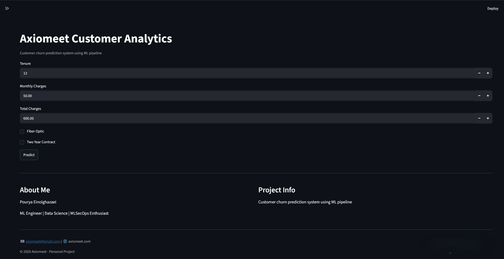
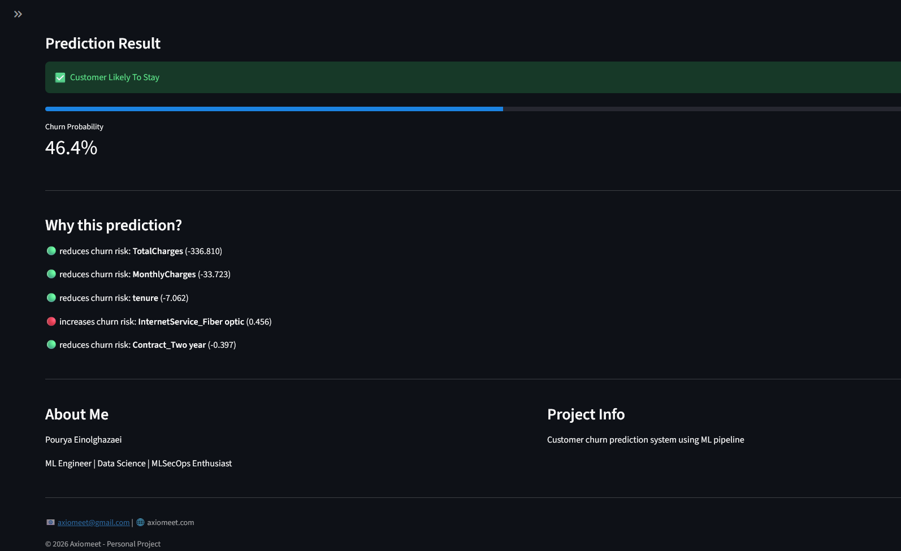

# Axiomeet Customer Analytics

Customer churn prediction system built with Machine Learning, Streamlit, and Docker.

This project predicts customer churn probability and provides interpretable outputs to help understand the drivers behind predictions.

---

## Features

* Customer churn prediction
* Interactive Streamlit dashboard
* Explainable prediction output
* Production-ready ML pipeline
* Dockerized application
* Structured project architecture

---

## Tech Stack

### Machine Learning

* Python
* Scikit-Learn
* Logistic Regression

### Data Processing

* Pandas
* NumPy

### Deployment

* Streamlit
* Docker

### Development

* Git
* Jupyter Notebook

---

## Project Architecture

```text
Data
 ↓
Preprocessing
 ↓
Feature Engineering
 ↓
Model Training
 ↓
Pipeline Serialization
 ↓
Prediction Service
 ↓
Streamlit UI
 ↓
Docker Deployment
```

---

## Dataset

Dataset used:

Telco Customer Churn Dataset

Target:

* Churn

Selected Features:

* tenure
* MonthlyCharges
* TotalCharges
* Contract
* InternetService
* PaymentMethod
* Partner
* Dependents
* TechSupport
* OnlineSecurity

---

## Model Performance

| Metric    | Score |
| --------- | ----- |
| Accuracy  | 0.738 |
| Precision | 0.504 |
| Recall    | 0.786 |
| F1 Score  | 0.614 |

---

## Application Preview

### Dashboard



---

### Prediction Example



---

## Run Locally

Clone repository:

```bash
git clone <YOUR_REPO_URL>
```

Move into project:

```bash
cd smart-customer-analytics
```

Install dependencies:

```bash
pip install -r requirements.txt
```

Run application:

```bash
streamlit run app/streamlit/app.py
```

---

## Run With Docker

Build image:

```bash
docker build -t axiomeet-churn .
```

Run container:

```bash
docker run -p 8501:8501 axiomeet-churn
```

Open:

```text
http://localhost:8501
```

---

## Author

Pourya Einolghazaei

ML Engineer • Data Science • MLSecOps Enthusiast

Axiomeet

Email:
[axiomeet@gmail.com](mailto:axiomeet@gmail.com)

Website:
axiomeet.com

---

## License

MIT License
